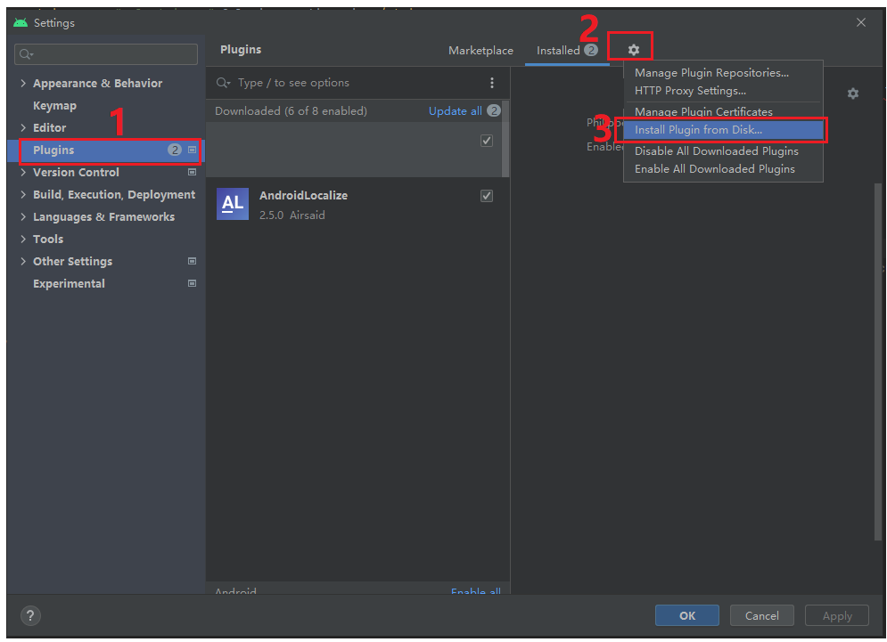
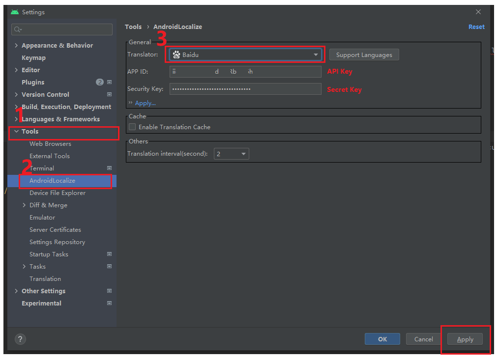
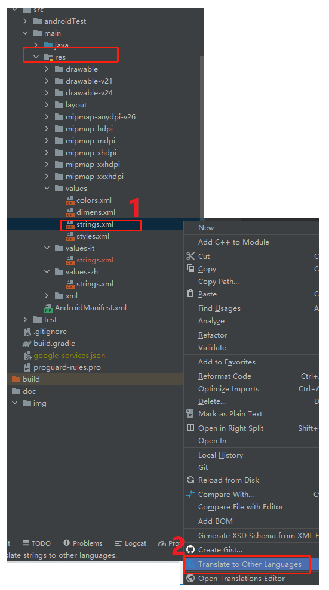

[English](README.md) | **简体中文**

#  AndroidLocalizePlugin Fix
[](https://plugins.jetbrains.com/plugin/11174-androidlocalize)
[](https://plugins.jetbrains.com/plugin/11174-androidlocalize)

:earth_asia: Android/IDEA 本地化插件，支持多种语言和翻译器。

修复版
截至 2022年3月25日 修复了Google免费翻译和百度API翻译，正常使用，已申请PR

本地安装 请下载 releases 版本，

本地安装： File | Settings | Plugins , 选项-Install Plugin from Disk...

使用方式： 选择 Res | String.xml 文件，右键，选择目标语言，貌似只能选择 values目录，建议原始语言使用英文，翻译其他语言更顺利

设置方式： File | Settings | Tools | AndroidLocalize 选择翻译渠道，
  目前测试Google和Baidu 正常，百度需要申请翻译服务，注意本修覅后填写的服务KEY 是API Key和 Secret Key

安装


设置：


使用1



# 功能
- 多翻译器支持：
  - Google 翻译
  - 微软翻译
  - 百度翻译
  - 有道翻译
- 支持最多 100+ 语言。
- 一键生成所有翻译文件。
- 支持不翻译已经存在的 string。
- 支持不翻译指定的文本。
- 支持缓存已翻译的 strings。
- 支持设置翻译间隔时间。

# 预览


# 安装
[](https://plugins.jetbrains.com/plugin/11174-androidlocalize)

# 使用
- 第一步：选择 values/strings.xml 文件。
- 第二步：右键选择：“Translate to Other Languages”。
- 第三步：勾选上需要翻译的语言。
- 第四步：点击 OK。

# 常见问题
- 问题：如何忽略不让其翻译？

    回答：可以使用 [translatable 或 xliff:g](https://developer.android.com/guide/topics/resources/localization#managing-strings) 标签。示例：
    ```
    <string name="app_name" translatable="false">HelloAndroid</string>
    <string name="star_rating">Check out our 5<xliff:g id="star">\u2605</xliff:g></string>
    <string name="app_home_url">Visit us at <xliff:g id="application_homepage">https://github.com/Airsaid/AndroidLocalizePlugin</xliff:g></string>
    <string name="prod_name">Learn more at <xliff:g id="game_group">Muggle Game Studio</xliff:g></string>
    ```
  **注意：一行展示，中间不要有多余的换行和空格。**

# 更新日志
[更新日志](CHANGELOG.md)

# 赞助商
[](https://jb.gg/OpenSourc)

# 许可证
```
Copyright 2018 Airsaid. https://github.com/airsaid

Licensed under the Apache License, Version 2.0 (the "License");
you may not use this file except in compliance with the License.
You may obtain a copy of the License at

   http://www.apache.org/licenses/LICENSE-2.0

Unless required by applicable law or agreed to in writing, software
distributed under the License is distributed on an "AS IS" BASIS,
WITHOUT WARRANTIES OR CONDITIONS OF ANY KIND, either express or implied.
See the License for the specific language governing permissions and
limitations under the License.
```
