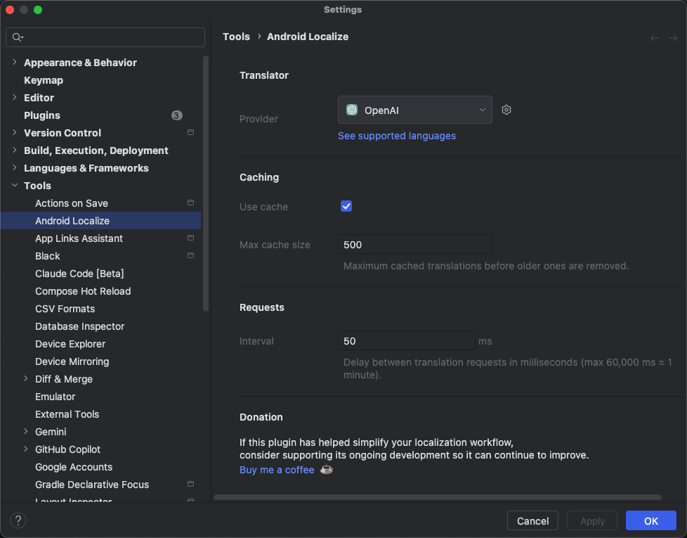

[English](README.md) | **简体中文**

#  AndroidLocalizePlugin
[](https://plugins.jetbrains.com/plugin/11174-androidlocalize)
[](https://plugins.jetbrains.com/plugin/11174-androidlocalize)
[](https://github.com/Airsaid/AndroidLocalizePlugin/actions/workflows/build.yml)

[Website](https://plugins.jetbrains.com/plugin/11174-androidlocalize) | [GitHub](https://github.com/Airsaid/AndroidLocalizePlugin) | [Issues](https://github.com/Airsaid/AndroidLocalizePlugin/issues) | [Reviews](https://plugins.jetbrains.com/plugin/11174-androidlocalize/reviews)

Android 本地化插件，支持多种语言和翻译器。

# 功能
- 多翻译器支持：
  - Google 翻译。
  - 微软翻译。
  - 百度翻译。
  - 有道翻译。
  - 阿里翻译。
  - DeepL 翻译。
  - OpenAI ChatGPT 翻译。
- 支持最多 100+ 语言。
- 一键生成所有翻译文件。
- 支持不翻译已经存在的 string。
- 支持不翻译指定的文本。
- 支持缓存已翻译的 strings。
- 支持设置翻译间隔时间。

# 使用
- 第一步：选择 `values/strings.xml` 文件（或者是 values 目录下的任何资源文件）。
- 第二步：右键选择：“Translate to Other Languages”。
- 第三步：勾选上需要翻译的语言。
- 第四步：点击 OK。

# 预览



# 安装
[](https://plugins.jetbrains.com/plugin/11174-androidlocalize)

# 常见问题
- 问题：如何忽略不让其翻译？

    回答：可以使用 [translatable 或 xliff:g](https://developer.android.com/guide/topics/resources/localization#managing-strings) 标签。示例：
    ```
    <string name="app_name" translatable="false">HelloAndroid</string>
    <string name="star_rating">Check out our 5<xliff:g id="star">\u2605</xliff:g></string>
    <string name="app_home_url">Visit us at <xliff:g id="application_homepage">https://github.com/Airsaid/AndroidLocalizePlugin</xliff:g></string>
    <string name="prod_name">Learn more at <xliff:g id="game_group">Muggle Game Studio</xliff:g></string>
    ```
  **注意：一行展示，中间不要有多余的换行和空格。**
  
- 问题：Translation failure: java.net.HttpRetryException: cannot retry due to redirection, in streaming mode

  回答：如果你使用的是默认的翻译引擎（Google），那么你可以在设置页面尝试切换到其他引擎，并使用自己的账号进行翻译。因为默认的翻译引擎并不稳定。

# 更新日志
[更新日志](CHANGELOG.md)

# 支持和捐赠

您可以通过执行以下任意操作来贡献和支持此项目：

- 在 GitHub 上 Star 该项目。
- 反馈问题。
- 提交 PR。
- 提出您的想法或建议。
- 将插件分享给您的朋友和同事。
- 如果您喜欢这个插件，请考虑捐赠以维持该插件和后续的更新：

  <table>
    <thead align="center">
      <tr>
        <th><a href="https://opencollective.com/androidlocalizeplugin" target="_blank">Open Collective</a></th>
        <th><a href="https://pay.weixin.qq.com/index.php/public/wechatpay_en" target="_blank">微信支付</a></th>
        <th><a href="https://global.alipay.com" target="_blank">支付宝</a></th>
      </tr>
    </thead>
    <tr align="center">
      <td>
        <a href="https://opencollective.com/androidlocalizeplugin/donate" target="_blank">
          
        </a>
      </td>
      <td>
        <a href="https://pay.weixin.qq.com/index.php/public/wechatpay_en" target="_blank">
          
        </a>
      </td>
      <td>
        <a href="https://global.alipay.com" target="_blank">
          
        </a>
      </td>
    </tr>
  </table>

**感谢您的支持！**

# 赞助商
[](https://jb.gg/OpenSourc)

# 许可证
```
Copyright 2018 Airsaid. https://github.com/airsaid

Licensed under the Apache License, Version 2.0 (the "License");
you may not use this file except in compliance with the License.
You may obtain a copy of the License at

   http://www.apache.org/licenses/LICENSE-2.0

Unless required by applicable law or agreed to in writing, software
distributed under the License is distributed on an "AS IS" BASIS,
WITHOUT WARRANTIES OR CONDITIONS OF ANY KIND, either express or implied.
See the License for the specific language governing permissions and
limitations under the License.
```
